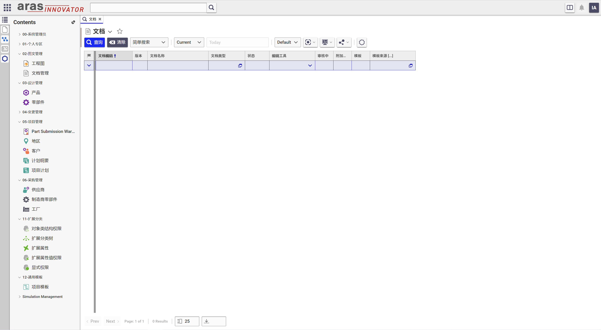

# Aras Innovator 简体中文汉化包

Aras Innovator 系统页面中文汉化包

## 支持系统版本

Project | Aras
--------|------
[v1.0.0](https://github.com/tengzhuang1/zh-CN_LanguagePack/releases/tag/v1.0.0) | Aras 2023 Release Build 14.0.9.36244

## 安装

在将此语言包导入生产环境之前，Aras建议您创建数据库和代码树的备份。

这些是使用当前中文简体语言包和zh-cn语言环境设置机器的通用说明。
请注意，此中文简体语言包的安装适用于大多数用户将运行中文简体Aras Innovator的系统。

Step 1 - 修改配置文件.
-----------------------------
1) 编辑 `SETUP-DEFAULTS.CMD`.

    您需要定义以下每个变量:

    前四个变量用于创建语言和区域设置，以及使用解决方案升级工具进行任何其他AML更改。

    * **SERVER_URL** = Aras Innovator系统地址

             范例: http://localhost/InnovatorServer
             确保不要在URL http://localhost/InnovatorServer/Client 中包含/Client

    * **DATABASE_ID** = Aras Innovator数据库的id。

            该值可以在DB-connection标签中的Aras Innovator InnovatorServerConfig.xml中找到。(id = "InnovatorSolutions")

    * **INNOVATOR_LOGIN** = 管理员账户.
                  
            建议使用 root
    * **INNOVATOR_PASSWORD** = 管理员密码.

            管理员默认密码为 innovator

    后四个变量用于使用语言包管理实用程序导入语言值。
   
    * **DB_SERVER** = 数据库地址.

            该值可以在DB-connection标签中的Aras Innovator InnovatorServerConfig.xml中找到。(服务器=“localhost”)
    * **DATABASE_NAME** = 数据库名称.

            该值可以在DB-connection标签中的Aras Innovator InnovatorServerConfig.xml中找到。(数据库= " InnovatorSolutions”)
    * **SQL_LOGIN** = 分配给SQL Server中Aras innovator数据库的innovator用户的登录名.

            这个值可以在DB-connection标签中的Aras Innovator InnovatorServerConfig.xml中找到。(uid =“innovator”)
    * **SQL_PASSWORD** = SQL Server中Aras innovator数据库的innovator用户的登录密码.

            该值可以在DB-connection标签中的Aras Innovator InnovatorServerConfig.xml中找到。(pwd =“innovator”)

Step 2 - 安装客户端xml目录.
--------------------------------------------
将此目录中的\Innovator文件夹复制到服务器覆盖Aras Innovator安装文件夹中的\Innovator文件夹。

这将在Aras Innovator代码树中创建新的目录:

\OAuthServer\i18n\xml.zc

\Innovator\Client\xml.zc

\Innovator\Client\Solutions\PLM\xml.zc

\Innovator\Client\Modules\aras.innovator.core.EffectivityServices\xml.zc

\Innovator\Client\Modules\aras.innovator.DomainAccessControl\xml.zc

\Innovator\Client\Modules\aras.innovator.ExtendedClassification\xml.zc

\Innovator\Client\Modules\aras.innovator.MacPolicy\xml.zc

\Innovator\Client\Modules\aras.innovator.MassPromote\xml.zc

\Innovator\Client\Modules\aras.innovator.CMF\xml.zc

\Innovator\Client\Modules\aras.innovator.CUI\xml.zc

\Innovator\Client\Modules\aras.innovator.ES\xml.zc

\Innovator\Client\Modules\aras.innovator.Izenda\xml.zc

\Innovator\Client\Modules\aras.innovator.QueryBuilder\xml.zc

\Innovator\Client\Modules\aras.innovator.SSVC\xml.zc

\Innovator\Client\Modules\aras.innovator.TDF\xml.zc

\Innovator\Client\Modules\aras.innovator.TreeGridView\xml.zc

\Innovator\Client\Modules\aras.innovator.Viewers\xml.zc

\Innovator\Client\scripts\CodeEditor\xml.zc

\Innovator\Client\scripts\ReportTool\xml.zc

\Innovator\Client\scripts\SitePreference\xml.zc

系统可能会提示您覆盖多个文件，这是进行更改以正确查看简体中文标签所必需的

Step 3 -运行批处理脚本.
------------------------------
1) `001-IMPORT-I18N-CHANGES.BAT`

    该文件将通过导入的方式在Aras Innovator中建立中文区域与简体中文语言.

2) `003-RESTART-WEB-SERVICE.BAT`

    该文件将重启IIS服务.

3) `004-IMPORT-CHINESE_SIMP.BAT`

    该文件将导入简体中文语言包.

## 技术交流 📣
[QQ群:197823386](http://qm.qq.com/cgi-bin/qm/qr?_wv=1027&k=9QBAR-Ra85m9l3GUxCX49rRFPWLs87FG&authKey=kdr98tqLBx2rF5swIO5%2BiKGQRJdLt8DZ5t2sSHY8pWfHhmjAioXEfWJfs4wShNfJ&noverify=0&group_code=197823386)

